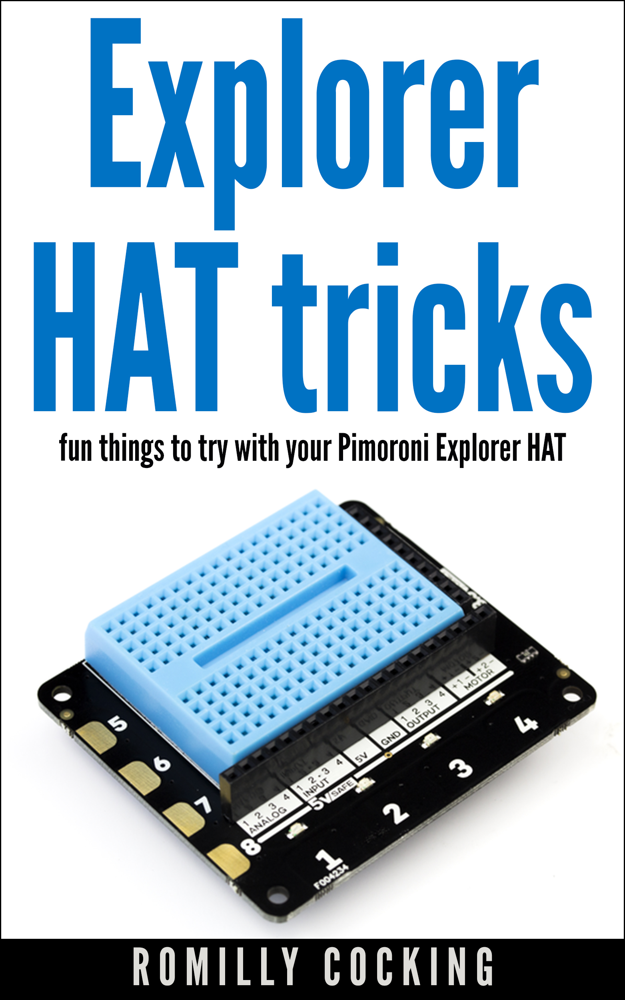

Type: Resources
Label: Resources
Title: Books, Guides and Presentations

## Books

Comprehensive, concise, essy to read books for digital makers.

Available on Leanpub with a 45-day no-quibble money-back guarantee and free updates.

### Explorer Hat Tricks

##### fun things to try with your Pimoroni Explorer Hat

If you're getting staarted with physical computing on the Raberry Pi, the Pimoron Explorer Hat is a great place to start. In this clear, concies and comptrenhesinge book, you'll learn loadsa stuff.

## Guides

